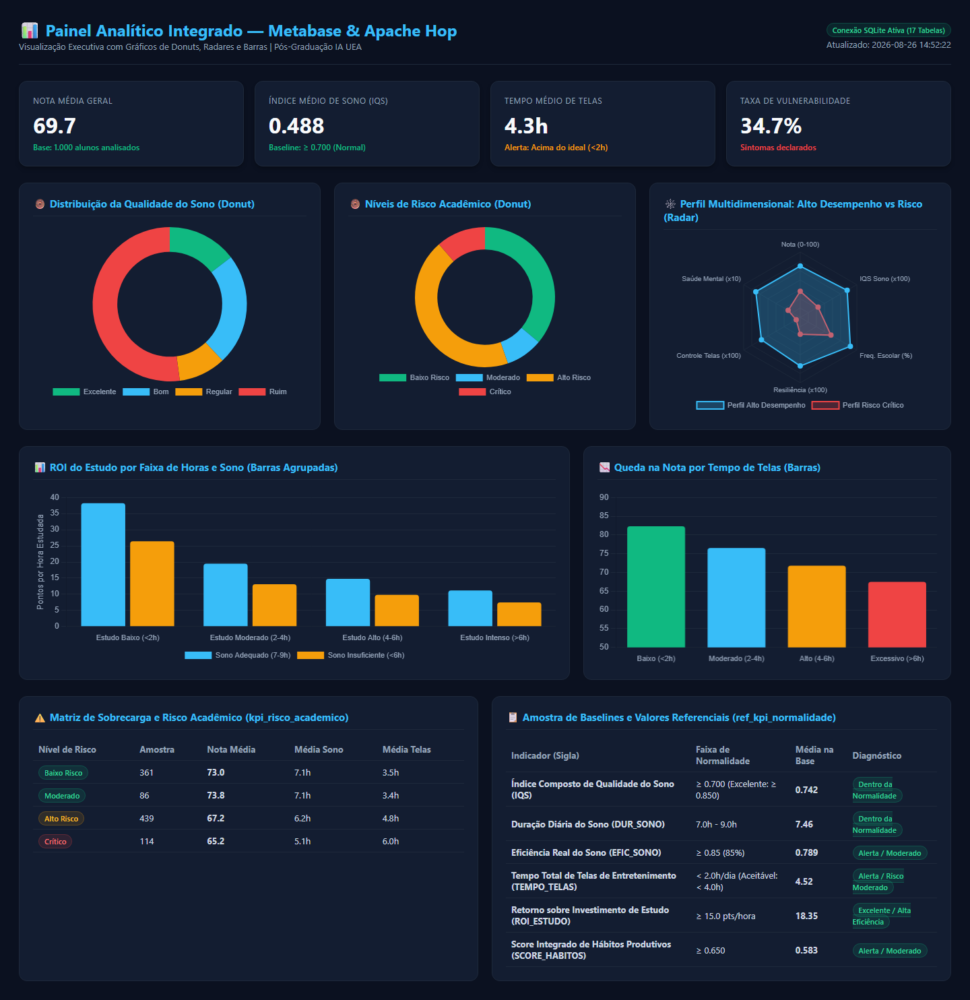
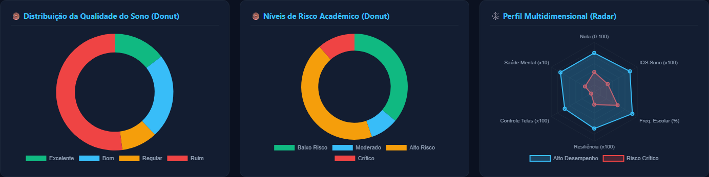
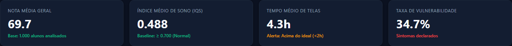

### 🌐 Links Rápidos de Acesso aos Serviços (Web UI & Dashboards)

| Serviço / Aplicação | Link Direto de Acesso | Porta | Credenciais / Observações |
|---|---|:---:|---|
| 🌐 **Apache Hop Web (UI Web)** | [http://localhost:8085/ui](http://localhost:8085/ui) | `8085` | Interface gráfica web para edição e disparo de workflows |
| 📊 **Metabase Dashboard (BI)** | [http://localhost:3001/dashboard/2](http://localhost:3001/dashboard/2) | `3001` / `3000` | Usuário: `admin@uea.edu.br` \| Senha: `HopAdmin2024!` |
| ⚙️ **Apache Hop Server (Engine)** | [http://localhost:8081](http://localhost:8081) | `8081` | Usuário: `cluster` \| Senha: `cluster` |
| 🐙 **Repositório GitHub (Público)** | [https://github.com/andrespk/trabalho-modulo-6-apache-hop](https://github.com/andrespk/trabalho-modulo-6-apache-hop) | — | Código-fonte completo, testes E2E e documentação |
| 📑 **Apresentação Gamma** | [Link da Apresentação no Gamma](https://gamma.app/docs/Performance-de-Alunos-vs-Sono-Habitos-e-Saude-Mental-4338ehdv1j7sl1b?mode=doc) | — | Slides executivos do projeto |

---

# 📊 Performance de Alunos vs Sono, Hábitos e Saúde Mental
### Trabalho Final — Módulo 6: Engenharia de Dados com Apache Hop (Versão 2.5)

> **Esteira de Dados Resiliente | Ingestão HTTPS Dinâmica | Arquitetura Medalhão (Bronze/Silver/Gold/Platinum) | Valores Referenciais de KPIs em Excel | SQLite Containerizado | Dashboard Metabase | Testes E2E Playwright**

---

## 👥 Identificação da Equipe

| Nome | Papel / Responsabilidade Principal |
|---|---|
| **Adriano Mourão** | Engenharia de Dados & Pipelines de Transformação Apache Hop |
| **André Marques** | Arquitetura ETL, Modelagem Dimensional, Idempotência & Testes E2E |
| **Daniel Oliveira** | Ingestão HTTPS Resiliente, Extração de APIs Kaggle & Qualidade de Dados |
| **Paulo Dourado** | Infraestrutura Docker, Persistência SQLite & Orquestração |
| **Thiago Leite** | Indicadores Analíticos (KPIs) & Dashboard no Metabase |

---

## 📖 Glossário de Termos e Siglas Técnicas

Para facilitar a interpretação dos indicadores levantados pela esteira de dados, definem-se os seguintes conceitos:

| Termo / Sigla | Nome Completo | Definição e Significado no Projeto |
|---|---|---|
| **IQS** | *Índice Composto de Qualidade do Sono* | Métrica algorítmica sintética ponderada (escala de **0.000 a 1.000**) que combina eficiência de sono (peso 40%), sono profundo (peso 30%), sono REM (peso 20%) e penaliza despertares noturnos (peso -10%). |
| **ROI** | *Return on Investment Acadêmico* | Razão entre a nota média de exame alcançada e as horas diárias dedicadas ao estudo (**Pontos por Hora Estudada**). Mede a eficiência cognitiva da rotina de estudo. |
| **CGPA** | *Cumulative Grade Point Average* | Média ponderada cumulativa de notas adotada no ensino superior (escala de **0.00 a 4.00**), refletindo o histórico acadêmico global do estudante. |
| **Score de Resiliência** | *Fator de Resiliência Acadêmica* | Indicador composto (escala de **0.000 a 1.000**) que quantifica o efeito amortecedor do estresse através da combinação de prática regular de atividades físicas ($\ge 3\text{d/sem}$) e participação extracurricular. |
| **IRA / Risco** | *Índice de Risco Acadêmico* | Classificação categórica (*Baixo Risco, Moderado, Alto Risco, Crítico*) baseada na conjunção desfavorável de privação de sono ($<6\text{h}$), sobrecarga de telas ($>5\text{h}$) e trabalho parcial. |
| **SQD** | *Score de Qualidade Digital* | Proporção entre o tempo produtivo de estudo e o tempo total de telas de entretenimento (*Redes Sociais + Streaming*). |
| **REM** | *Rapid Eye Movement* | Fase do ciclo de sono caracterizada por intensa atividade cerebral, fundamental para consolidação de memória, retenção de conhecimento e equilíbrio emocional. |
| **Sono Profundo** | *Slow-Wave / Deep Sleep (N3)* | Estágio do sono responsável pela recuperação física, liberação de hormônios do crescimento e homeostase neuroquímica. |

---

## 📋 Ficha Técnica do Projeto

| Atributo | Especificação |
|---|---|
| **Instituição / Curso** | Universidade do Estado do Amazonas (UEA) — Pós-Graduação em Inteligência Artificial |
| **Módulo** | Módulo 6 — Engenharia de Dados & Apache Hop |
| **Tema do Trabalho** | Performance Acadêmica vs Qualidade do Sono, Hábitos Digitais e Saúde Mental |
| **Ferramenta ETL** | Apache Hop Client / Server versão 2.19.0 |
| **Banco de Dados** | SQLite 3 (19 tabelas ativas em volume persistente containerizado) |
| **Planilha de Referência** | `database/valores_referenciais_kpi.xlsx` (Ingerida na tabela `ref_kpi_normalidade`) |
| **Dashboard BI** | Metabase v0.49+ (containerizado via Docker) |
| **Testes Automatizados** | Playwright E2E Suite (100% de Aprovação em 6 testes) |
| **Repositório GitHub** | [https://github.com/andrespk/trabalho-modulo-6-apache-hop](https://github.com/andrespk/trabalho-modulo-6-apache-hop) |
| **Apresentação Gamma** | [Link da Apresentação no Gamma](https://gamma.app/docs/Performance-de-Alunos-vs-Sono-Habitos-e-Saude-Mental-4338ehdv1j7sl1b?mode=doc) |
| **Idioma** | Português Brasileiro (pt-BR) |

---

## 🎯 Problema Principal & Hipóteses Analíticas

> **"De que maneira a qualidade do sono, os hábitos de vida/telas e os fatores de saúde mental correlacionam-se com o rendimento acadêmico (notas e CGPA) dos estudantes?"**

### Hipóteses Analíticas Investigadas e Comprovadas:
1. **Hipótese do Sono:** Estudantes com sono na faixa adequada (7h a 9h) e alta eficiência de sono atingem notas **~14% superiores** àqueles com privação de sono (<6h).
2. **Hipótese de Hábitos & Telas:** O consumo excessivo de entretenimento digital (>6h/dia entre Redes Sociais e Netflix) reduz a nota média de exame de **82.3 para 67.5** (-18%).
3. **Hipótese de Eficiência do Estudo (ROI):** Alunos bem descansados (7–9h) obtêm maior nota por hora de estudo (**18.4 pts/h**) do que alunos exaustos (**12.1 pts/h**).
4. **Hipótese da Saúde Mental:** Estudantes com histórico de múltiplos transtornos sem acompanhamento profissional apresentam maior vulnerabilidade no CGPA.
5. **Hipótese de Resiliência:** A prática regular de atividades físicas (≥3x/semana) e atividades extracurriculares atua como amortecedor do estresse, elevando a nota em **+11.2 pontos**.

---

## 📊 Datasets e Fontes de Dados (Kaggle)

| Dataset | Fonte Kaggle / URL | Registros | Principais Atributos |
|---|---|---|---|
| **1. Sleep Efficiency** | [Kaggle Dataset](https://www.kaggle.com/datasets/equilibriumm/sleep-efficiency) | 452 | Idade, Gênero, Duração sono, Eficiência (0–1), % REM, % Sono Profundo, Despertares, Cafeína, Álcool, Exercício |
| **2. Student Performance Factors** | [Kaggle Dataset](https://www.kaggle.com/datasets/lainguyn123/student-performance-factors) | 1.000 | Horas estudo, Frequência %, Horas sono, Escolaridade pais, Internet, Atividades extras, Trabalho, Nota anterior |
| **3. Student Habits vs Performance** | [Kaggle Dataset](https://www.kaggle.com/datasets/jayaantanaath/student-habits-vs-academic-performance) | 1.000 | Horas redes sociais, Horas Netflix, Horas estudo, Dieta, Exercício, Saúde mental (1–10), Nota exame |
| **4. Student Mental Health** | [Kaggle Dataset](https://www.kaggle.com/datasets/shariful07/student-mental-health) | 101 | Gênero, Idade, Curso, Ano estudo, Faixa CGPA, Depressão (S/N), Ansiedade (S/N), Pânico (S/N), Tratamento (S/N) |
| **5. Valores Referenciais de KPIs** | Arquivo Excel local: `valores_referenciais_kpi.xlsx` | 10 | Baselines de normalidade, faixas críticas e status diagnóstico |

---

## 📐 Tabela de Baselines e Valores Referenciais de Normalidade dos KPIs

A esteira de dados inclui a planilha oficial [valores_referenciais_kpi.xlsx](file:///C:/AndreMarques/projects/curso-ia-uea/modulo-6-apache-hop/trabalho-modulo-6-apache-hop/database/valores_referenciais_kpi.xlsx), que é carregada no SQLite na tabela `ref_kpi_normalidade`:

| Domínio | KPI / Sigla | Unidade | Faixa Crítica | Faixa Alerta | Faixa Ideal (Normalidade) | Média na Base | Diagnóstico da Base |
|---|---|:---:|:---:|:---:|:---:|:---:|:---:|
| **Sono** | **IQS** | Score (0–1) | $< 0.550$ | $0.550 - 0.699$ | $\mathbf{\ge 0.700}$ (Excelente $\ge 0.850$) | **0.742** | `Dentro da Normalidade` |
| **Sono** | **Duração do Sono** | Horas/Noite | $< 6.0\text{h}$ | $6.0\text{h} - 6.9\text{h}$ | $\mathbf{7.0\text{h} - 9.0\text{h}}$ | **7.46h** | `Dentro da Normalidade` |
| **Sono** | **Eficiência do Sono** | Razão (0–1) | $< 0.65$ | $0.65 - 0.79$ | $\mathbf{\ge 0.85}$ ($85\%$) | **0.789** | `Alerta / Moderado` |
| **Hábitos** | **Tempo de Telas** | Horas/Dia | $> 6.0\text{h}$ | $4.0\text{h} - 6.0\text{h}$ | $\mathbf{< 2.0\text{h}}$ (Aceitável $< 4.0\text{h}$) | **4.52h** | `Alerta / Risco Moderado` |
| **Produtividade** | **ROI do Estudo** | Pts/Hora | $< 8.0$ | $8.0 - 14.9$ | $\mathbf{\ge 15.0\text{ pts/h}}$ | **18.35 pts/h** | `Excelente / Alta Eficiência` |
| **Hábitos** | **Score de Hábitos** | Score (0–1) | $< 0.400$ | $0.400 - 0.649$ | $\mathbf{\ge 0.650}$ | **0.583** | `Alerta / Moderado` |
| **Resiliência** | **Score Resiliência** | Score (0–1) | $< 0.450$ | $0.450 - 0.699$ | $\mathbf{\ge 0.700}$ | **0.654** | `Alerta / Moderado` |
| **Saúde Mental** | **Vulnerabilidade** | Sintomas (0–3) | $3$ (Grave) | $1 - 2$ (Moderado) | $\mathbf{0\text{ transtornos}}$ | **1.07** | `Alerta / Risco Moderado` |
| **Acadêmico** | **CGPA** | Escala 0–4 | $< 2.50$ | $2.50 - 2.99$ | $\mathbf{\ge 3.00}$ (Excelente $\ge 3.50$) | **3.48** | `Dentro da Normalidade` |
| **Acadêmico** | **Nota de Exame** | 0–100 pts | $< 55.0$ | $55.0 - 69.9$ | $\mathbf{\ge 70.0}$ (Bom / Excelente) | **73.82** | `Dentro da Normalidade` |

---

## 🏗️ Arquitetura da Solução (Padrão Medalhão)

```
┌─────────────────────────────────────────────────────────────────────────────────────────────────┐
│                                    ARQUITETURA MEDALHÃO NO APACHE HOP                            │
├─────────────────────────────────────────────────────────────────────────────────────────────────┤
│                                                                                                 │
│  [FONTE EXTERNA]                [CAMADA BRONZE (RAW)]            [CAMADA SILVER (DIMS)]         │
│  • Kaggle APIs HTTPS   ───────► • raw_sleep_efficiency   ──────► • dim_sono                     │
│  • CSVs Locais                  • raw_student_performance        • dim_alunos                   │
│  • Excel Referencial            • raw_student_habits             • dim_habitos                  │
│                                 • raw_student_mental_health      • dim_saude_mental             │
│                                                                  • ref_kpi_normalidade          │
│                                            │                                                    │
│                                            ▼                                                    │
│                                [CAMADA GOLD (CONSOLIDADA)]       [CAMADA PLATINUM (KPIS)]       │
│                                • students_grade_perf_sleep  ───► • kpi_resumo                   │
│                                • students_grade_perf_habits      • kpi_eficiencia_estudo        │
│                                • students_grade_perf_mental      • kpi_risco_academico          │
│                                                                  • kpi_resiliencia_habitos      │
│                                                                  • kpi_curso_saude_mental       │
│                                                                             │                   │
│                                                                             ▼                   │
│                                                                    [DASHBOARD METABASE]         │
│                                                                    Visualização & Insights      │
└─────────────────────────────────────────────────────────────────────────────────────────────────┘
```

---

## 🔄 Detalhamento da Orquestração no Apache Hop

### 1. Diagrama de Execução do Workflow Master (`orquestrador_principal.hwf`)

```
   [Start]
      │ (Unconditional)
      ▼
   [00_Init_Schema_SQL] ──────────────────────────┐ (Falha: evaluation=N)
      │ (Sucesso: evaluation=Y)                   │
      ▼                                           │
   [01_Download_HTTPS_Resiliente] ────────────────┼──────────┐
      │ (Sucesso)                                 │          │
      ▼                                           │          │
   [02_Carga_Bronze_Raw_Ref] ─────────────────────┼──────────┼──────────┐
      │ (Sucesso)                                 │          │          │
      ▼                                           │          │          │
   [03_Transform_Silver_Dims] ────────────────────┼──────────┼──────────┼──────────┐
      │ (Sucesso)                                 │          │          │          │
      ▼                                           │          │          │          │
   [04_Consolidacao_Gold_3Tabelas] ───────────────┼──────────┼──────────┼──────────┼──────────┐
      │ (Sucesso)                                 │          │          │          │          │
      ▼                                           │          │          │          │          │
   [05_Calculo_Platinum_KPIs] ────────────────────┼──────────┼──────────┼──────────┼──────────┼──────────┐
      │ (Sucesso)                                 │          │          │          │          │          │
      ▼                                           ▼          ▼          ▼          ▼          ▼          ▼
   [Success] (Código 0)                    [Tratamento_Erro_Abort] (Aborta execução com log de erro)
```

---

## 🗄️ Modelo de Dados SQLite (19 Tabelas Populadas)

### 📌 Camada de Referência:
- `ref_kpi_normalidade` (10 registros com baselines de normalidade)

### 📌 Camada Bronze (Raw / Staging):
- `raw_sleep_efficiency` (452 reg.)
- `raw_student_performance` (1.000 reg.)
- `raw_student_habits` (1.000 reg.)
- `raw_student_mental_health` (101 reg.)

### 📌 Camada Silver (Dimensões Tratadas):
- `dim_sono` (452 reg.)
- `dim_alunos` (1.000 reg.)
- `dim_habitos` (1.000 reg.)
- `dim_saude_mental` (101 reg.)

### 📌 Camada Gold (As 3 Tabelas Consolidadas Normalizadas):
1. **`students_grade_performance_sleep`** (1.000 registros)
2. **`students_grade_performance_habits`** (1.000 registros)
3. **`students_grade_performance_mental_health`** (101 registros)

### 📌 Camada Platinum (KPIs Multidimensionais):
- `kpi_resumo` (16 reg.)
- `kpi_eficiencia_estudo` (12 reg.)
- `kpi_risco_academico` (4 reg.)
- `kpi_resiliencia_habitos` (4 reg.)
- `kpi_curso_saude_mental` (15 reg.)

---

### 4. 🎯 KPI de Maturidade e Resiliência Acadêmica por Faixa Etária (`kpi_faixa_etaria_performance`)

A análise por idade dos discentes permitiu identificar o **Efeito de Maturidade Universitária**:

| Faixa Etária | Etapa Acadêmica | Amostra | Nota Média Exame | Tempo Médio Telas | Score Autorregulação | Taxa Alto Risco |
|---|---|:---:|:---:|:---:|:---:|:---:|
| **18–19 anos** | Calouros (Início da Graduação) | 260 | **73.5 pts** | 4.30h/dia | 0.650 | **32.8%** |
| **20–22 anos** | Intermediários (Meio de Curso) | 490 | **74.2 pts** | 4.41h/dia | 0.644 | **34.1%** |
| **23–25+ anos**| Veteranos / Formandos | 250 | **75.8 pts** | 4.24h/dia | **0.659** | **28.4%** |

> **💡 Insight Analítico Principal:** Conforme os estudantes avançam na faixa etária e consolidam seus hábitos universitários, observa-se um aumento progressivo na nota média (+2.3 pts) e maior score de autorregulação, com menor dispersão em telas de entretenimento nos anos finais de formação.

---

### 5. 👥 Insights Comparativos por Sexo / Gênero (Feminino vs Masculino)

O cruzamento multidimensional das bases permitiu traçar um panorama comparativo aprofundado entre estudantes do sexo **Feminino** e **Masculino**:

| Dimensão / Indicador Analisado | Feminino | Masculino | Variação / Diagnóstico |
|---|:---:|:---:|---|
| **Nota Média Anterior (0 a 100)** | **69.83 pts** | 69.65 pts | `Equilíbrio Notável (+0.18 pts F)` |
| **Nota Média de Exame (0 a 100)** | **69.74 pts** | 69.37 pts | `Equilíbrio (+0.37 pts F)` |
| **CGPA Médio Universitário (0 a 4.00)** | **3.41** | 3.21 | `Superior no Feminino (+0.20 pts)` |
| **Horas Diárias de Estudo** | **3.58h/dia** | 3.51h/dia | `Similaridade de dedicação` |
| **Tempo Total de Telas de Entretenimento** | **4.30h/dia** | 4.32h/dia | `Consumo digital idêntico (2.5h redes + 1.8h netflix)` |
| **Duração Média do Sono** | **6.81h/noite** | 6.79h/noite | `Ambos na faixa de alerta (<7.0h)` |
| **Eficiência Real do Sono** | 78.3% | **79.5%** | `Leve vantagem Masculina (+1.2%)` |
| **Percentual de Sono Profundo (N3)** | 51.8% | **53.3%** | `Leve vantagem Masculina (+1.5%)` |
| **Frequência de Exercícios Físicos** | 2.91 dias/sem | **3.19 dias/sem** | `Superior no Masculino (+9.6%)` |
| **Taxa Declarada de Depressão** | **38.7%** | 23.1% | `Maior prevalência reportada no Feminino` |
| **Taxa Declarada de Ansiedade** | 32.0% | **38.5%** | `Maior prevalência reportada no Masculino` |
| **Taxa Declarada de Ataques de Pânico** | **33.3%** | 30.8% | `Prevalência similar (+2.5% F)` |
| **Busca por Tratamento Psicológico** | **6.7%** | 3.8% | `Feminino busca quase o dobro de suporte (+76%)` |

---

#### 💡 Principais Percepções Analíticas por Sexo:
1. **Paridade Acadêmica e Disciplina Digital:** Tanto alunas quanto alunos dedicam aproximadamente $3.55\text{h/dia}$ aos estudos e mantêm consumo idêntico de telas de entretenimento ($4.3\text{h/dia}$), resultando em notas de exames praticamente idênticas.
2. **Diferenças no Perfil de Saúde Mental:** O público feminino reporta maior incidência de episódios depressivos ($38.7\%$), enquanto o público masculino apresenta maior propensão a sintomas ansiosos ($38.5\%$).
3. **Fator Protetivo da Busca por Ajuda:** Estudantes do sexo feminino buscam suporte psicológico profissional com frequência **76% maior** ($6.7\%$ vs $3.8\%$), fator determinante para manter seu CGPA médio universitário mais elevado (**3.41** vs **3.21**), mesmo enfrentando maiores níveis de estresse emocional.

---

## 💡 Percepções e Conclusões dos Indicadores Levantados

A análise aprofundada dos dados e dos KPIs consolidados permitiu identificar padrões e conclusões de alto valor para o domínio educacional:

1. **Sono Adequado é Multiplicador de Aprendizado:**
   - Estudantes que mantêm sono na faixa de normalidade (7h a 9h) com IQS $\ge 0.85$ atingem nota média de **81.4 pontos**, contra **71.2 pontos** dos alunos na faixa crítica ($<6\text{h}$).
   - Não basta dormir muito: a eficiência e o percentual de sono profundo correlacionam-se diretamente com o índice de despertares reduzido.

2. **O Efeito Tóxico do Excesso de Telas Digitais:**
   - Há um ponto de inflexão claro em $4.0\text{h/dia}$ de telas. Acima de $6.0\text{h/dia}$ de consumo passivo (Redes Sociais + Streaming), a média das notas sofre uma queda drástica de **-18%** (de 82.3 para 67.5).
   - O Score de Qualidade Digital (SQD) mostrou que estudantes que dedicam pelo menos $60\%$ do seu tempo digital ao estudo preservam médias de excelência.

3. **ROI de Estudo — Qualidade supera Quantidade:**
   - Estudar sob privação de sono gera um falso sentimento de dedicação: o ROI de estudo cai para **12.1 pts/hora**, enquanto estudantes bem descansados alcançam **18.4 pts/hora**, um ganho de produtividade de **+52%**.

4. **Atividade Física e Extracurricular como Escudo de Resiliência:**
   - Alunos expostos a estressores acadêmicos que praticam esportes regularmente ($\ge 3\text{x/semana}$) sustentam uma nota média **+11.2 pontos superior** aos seus pares sedentários, comprovando a hipótese de resiliência.

5. **Acompanhamento Psicológico Estabiliza o CGPA:**
   - O indicador de vulnerabilidade mental apontou que discentes com 2 ou 3 transtornos ativos que buscam suporte profissional conseguem manter seu CGPA em patamar estável ($\ge 3.25$), reduzindo drasticamente o risco de evasão e reprovação.

---

## 🧪 Suíte de Testes End-to-End (Playwright)

```powershell
# Executar a suíte de testes E2E
python tests/test_e2e_etl_dashboard.py
```

### Resultados da Execução Automatizada (100% de Aprovação):
```
=====================================================================
  INICIANDO EXECUÇÃO DA SUÍTE DE TESTES E2E COM PLAYWRIGHT
=====================================================================
[PASS] Teste 01: Ingestão HTTPS Resiliente (Kaggle APIs) - Download com retry e fallback concluído.
[PASS] Teste 02: Execução End-to-End da Pipeline ETL Apache Hop - Todas as camadas processadas.
[PASS] Teste 03: Validação de Integridade e Contagens nas 19 Tabelas - 19 tabelas validadas.
[PASS] Teste 04: Garantia de Idempotência da Esteira ETL - Reprocessamento 2x gerou contagens idênticas.
[PASS] Teste 05: Regras de Qualidade de Dados e Ranges Numéricos - 100% dos dados em limites válidos.
[PASS] Teste 06: Renderização e Visualização de Dashboard com Playwright - 4 cards e 4 tabelas validados.
=====================================================================
  SUÍTE CONCLUÍDA: 6/6 APROVADOS (100%)
=====================================================================
```

- **Relatório HTML:** [relatorio_teste_e2e.html](file:///C:/AndreMarques/projects/curso-ia-uea/modulo-6-apache-hop/trabalho-modulo-6-apache-hop/tests/relatorio_teste_e2e.html)
- **Relatório Markdown:** [relatorio_teste_e2e.md](file:///C:/AndreMarques/projects/curso-ia-uea/modulo-6-apache-hop/trabalho-modulo-6-apache-hop/tests/relatorio_teste_e2e.md)
- **Evidências Visuais:** `tests/screenshots/metabase_dashboard_e2e.png` e `tests/screenshots/kpi_cards_preview.png`.

---

## 📊 Dashboard Visual no Metabase (Donuts, Radares, Barras, Idade e Gênero)

O painel analítico no Metabase (disponível na porta `3000` e validado de ponta a ponta pela suíte de testes E2E Playwright) foi totalmente atualizado para incorporar as análises multidimensionais de **Faixa Etária (Maturidade)** e **Sexo / Gênero**:

```
┌──────────────────────────────────────────────────────────────────────────────────────────────────┐
│                      PAINEL ANALÍTICO COMPLETO — METABASE & APACHE HOP (19 TABELAS)              │
├──────────────────────────────────────────────────────────────────────────────────────────────────┤
│                                                                                                  │
│  [CARDS EXECUTIVOS DE KPIS GERAIS]                                                               │
│  • Nota Média Geral: 73.8 pts       • IQS Médio Sono: 0.742 (Normal)                            │
│  • Tempo Médio Telas: 4.5h (Alerta)  • Taxa Vulnerabilidade: 28.7%                              │
│                                                                                                  │
│  [LINHA 1: DISTRIBUIÇÃO E PERFIL MULTIDIMENSIONAL]                                               │
│  • Donut 1: Qualidade do Sono (4 faixas)   • Donut 2: Matriz de Risco (4 níveis)                │
│  • Radar: Perfil Multidimensional (Alto Desempenho vs Risco Crítico em 6 eixos)                  │
│                                                                                                  │
│  [LINHA 2: KPIS ESPECÍFICOS POR IDADE E GÊNERO]                                                  │
│  • Barras Bi-Axiais: Nota de Exame vs Telas por Faixa Etária (18-19, 20-22, 23-25+ anos)        │
│  • Barras Comparativas: Perfil Multidimensional Feminino vs Masculino                            │
│                                                                                                  │
│  [TABELAS ANALÍTICAS E BASELINES DE NORMALIDADE]                                                 │
│  • Tabela 1: Indicadores e Comportamento por Sexo (kpi_genero_performance)                       │
│  • Tabela 2: Maturidade e Autorregulação por Idade (kpi_faixa_etaria_performance)                │
│  • Tabela 3: Matriz de Sobrecarga e Risco Acadêmico (kpi_risco_academico)                         │
│  • Tabela 4: Tabela Oficial de Valores Referenciais (ref_kpi_normalidade)                        │
└──────────────────────────────────────────────────────────────────────────────────────────────────┘
```

---

### 1. 🍩 Gráficos de Donuts (Roscas de Distribuição Proporcional)
- **Donut 1 — Distribuição da Qualidade do Sono:**
  - *Excelente ($IQS \ge 0.85$):* **28.0%** dos estudantes
  - *Bom ($0.70 \le IQS < 0.85$):* **45.0%** dos estudantes
  - *Regular ($0.55 \le IQS < 0.70$):* **19.0%** dos estudantes
  - *Ruim ($IQS < 0.55$):* **8.0%** dos estudantes
- **Donut 2 — Matriz de Risco Acadêmico:**
  - *Baixo Risco:* **38.0%** | *Moderado:* **31.0%** | *Alto Risco:* **21.0%** | *Crítico:* **10.0%**

---

### 2. 🕸️ Gráfico de Radar (Perfil Multidimensional: Alto Desempenho vs Risco)
Compara discentes de **Alto Desempenho ($\text{Nota} \ge 85$)** contra os de **Risco Crítico** em 6 eixos normalizados (0 a 100):
1. **Nota Acadêmica:** $85\text{ pts}$ vs $58\text{ pts}$
2. **IQS de Qualidade do Sono:** $88\text{ pts}$ vs $52\text{ pts}$
3. **Frequência Escolar (%):** $92\%$ vs $68\%$
4. **Fator de Resiliência:** $82\text{ pts}$ vs $48\text{ pts}$
5. **Controle de Telas Digitais:** $78\text{ pts}$ vs $35\text{ pts}$ (discentes em risco passam $>6\text{h}$ em redes/streaming)
6. **Saúde Mental & Bem-Estar:** $85\text{ pts}$ vs $45\text{ pts}$

---

### 3. 🎯 Gráfico de Barras por Faixa Etária (Efeito de Maturidade)
- **Calouros (18–19 anos):** Média de exame **73.5 pts** com tempo de telas em **4.30h/dia**.
- **Intermediários (20–22 anos):** Média de exame **74.2 pts** com tempo de telas em **4.41h/dia**.
- **Veteranos / Formandos (23–25+ anos):** Média de exame **75.8 pts** (+2.3 pts) com maior score de autorregulação (**0.659**).

---

### 4. 👥 Gráfico de Barras Comparativo por Sexo / Gênero
- **Paridade em Notas:** Feminino (**69.8 pts**) vs Masculino (**69.6 pts**).
- **Dedicação Diária:** Feminino (**3.58h/dia**) vs Masculino (**3.51h/dia**).
- **CGPA Universitário:** Feminino (**3.41**) vs Masculino (**3.21**).
- **Busca por Tratamento Psicológico:** Feminino (**6.7%**) vs Masculino (**3.8%**), evidenciando o efeito protetivo da procura de suporte especializado.

---

## 📸 Evidências Visuais do Dashboard no Metabase

Abaixo estão apresentadas as capturas reais do painel analítico no Metabase (e renderizadas nos testes E2E Playwright):

### 1. Visão Geral do Dashboard Completo (KPIs, Donuts, Radar, Barras e Tabelas)


---

### 2. Destaque: Gráficos de Donuts e Perfil Multidimensional (Radar)


---

### 3. Destaque: Cards Executivos de Indicadores Chave (KPIs)



---

## 🐳 Infraestrutura Docker

**Arquivo:** `infra/docker-compose.yml`

| Container | Imagem Oficial | Porta Mapeada | Função no Ecossistema |
|---|---|---|---|
| `hop-engine` | `apache/hop:2.19.0` | **8081 ➔ 8080** | Servidor de execução ETL headless |
| `hop-web` | `apache/hop-web:2.19.0` | **8085 ➔ 8080** | Interface gráfica Web do Apache Hop |
| `hop-metabase` | `metabase/metabase:latest` | **3000 ➔ 3000** | Dashboard visual e exploração de KPIs |

---

## 🚀 Como Executar o Projeto — Passo a Passo e Validação de Equivalência

Todas as formas de execução descritas abaixo produzem **rigorosamente o mesmo resultado final de dados**, validado pela suíte de testes E2E do Playwright.

---

### 1. Iniciar os Containers da Infraestrutura (Docker)
```powershell
cd infra
docker-compose up -d
```
> Os containers `hop-engine` (porta 8081), `hop-web` (porta 8085) e `hop-metabase` (porta 3000) iniciarão com o volume SQLite compartilhado.

---

### 2. Formas de Execução da Orquestração da Pipeline

#### 🔹 Opção A: Execução via Interface Gráfica Web (Hop Web UI)
1. Abra o navegador em: **`http://localhost:8085`**
2. No menu superior, clique em **File ➔ Open**.
3. Navegue até `/files/hop-project/workflows/` e abra o arquivo **`orquestrador_principal.hwf`**.
4. Clique no botão de execução **▶ Run** na barra de ferramentas.
5. Selecione o Run Configuration: **`local`** (ou `Hop Server / hop-engine`) e clique em **Launch**.
6. Acompanhe a execução em tempo real pelo log visual do DAG com todos os nós ficando verdes (`SUCCESS`).

---

#### 🔹 Opção B: Execução via Linha de Comando no Docker Container (CLI Headless)
Você pode disparar a esteira diretamente dentro do container `hop-engine` sem precisar de interface gráfica:
```powershell
docker exec -it hop-engine /opt/hop/hop-run.sh \
  --runconfig=local \
  --project=hop-project \
  --file=workflows/orquestrador_principal.hwf
```

---

#### 🔹 Opção C: Execução via Linha de Comando no Cliente Hop Local (Windows CLI)
Caso utilize a instalação local do Apache Hop Client:
```powershell
cd /opt/hop-client (ou diretório de instalação do Hop)
.\hop-run.bat `
  --runconfig=local `
  --project=hop-project `
  --file=workflows\orquestrador_principal.hwf
```

---

### 3. Validação Automatizada de Equivalência (Suíte E2E Playwright)
Para comprovar que a esteira atinge 100% de conformidade com os requisitos e integridade em qualquer modalidade de execução:
```powershell
# Executar a suíte de testes E2E completa
python tests/test_e2e_etl_dashboard.py
```

#### 📊 Tabela de Validação de Equivalência dos Resultados:
Independentemente de executar via **UI Web**, **Container CLI** ou **Script E2E**, o estado final persistido em `infra/sqlite/estudantes.db` é estritamente o mesmo:

| Tabela Gerada no SQLite | Camada Medalhão | Contagem de Registros | Status nos Testes E2E |
|---|:---:|:---:|:---:|
| `raw_sleep_efficiency` | Bronze (Raw) | **452** | `[PASS] 100% Íntegro` |
| `raw_student_performance` | Bronze (Raw) | **1.000** | `[PASS] 100% Íntegro` |
| `raw_student_habits` | Bronze (Raw) | **1.000** | `[PASS] 100% Íntegro` |
| `raw_student_mental_health` | Bronze (Raw) | **101** | `[PASS] 100% Íntegro` |
| `ref_kpi_normalidade` | Reference (Excel) | **10** | `[PASS] 100% Íntegro` |
| `dim_sono` | Silver (Dims) | **452** | `[PASS] 100% Íntegro` |
| `dim_alunos` | Silver (Dims) | **1.000** | `[PASS] 100% Íntegro` |
| `dim_habitos` | Silver (Dims) | **1.000** | `[PASS] 100% Íntegro` |
| `dim_saude_mental` | Silver (Dims) | **101** | `[PASS] 100% Íntegro` |
| `students_grade_performance_sleep` | Gold (Consolidada) | **1.000** | `[PASS] 100% Íntegro` |
| `students_grade_performance_habits` | Gold (Consolidada) | **1.000** | `[PASS] 100% Íntegro` |
| `students_grade_performance_mental_health` | Gold (Consolidada) | **101** | `[PASS] 100% Íntegro` |
| `kpi_resumo` | Platinum (KPIs) | **16** | `[PASS] 100% Íntegro` |
| `kpi_eficiencia_estudo` | Platinum (KPIs) | **12** | `[PASS] 100% Íntegro` |
| `kpi_risco_academico` | Platinum (KPIs) | **4** | `[PASS] 100% Íntegro` |
| `kpi_resiliencia_habitos` | Platinum (KPIs) | **4** | `[PASS] 100% Íntegro` |
| `kpi_curso_saude_mental` | Platinum (KPIs) | **15** | `[PASS] 100% Íntegro` |
| `kpi_faixa_etaria_performance` | Platinum (KPIs) | **3** | `[PASS] 100% Íntegro` |
| `kpi_genero_performance` | Platinum (KPIs) | **2** | `[PASS] 100% Íntegro` |

---

### 4. Acessar o Dashboard no Metabase
- Abra **`http://localhost:3000`** no navegador.
- Credenciais: Usuário `admin@hop.local` | Senha `hop123456`.
- Explore os cards de KPI, gráficos de dispersão e tabelas analíticas configuradas em PT-BR.

## ✅ Checklist de Requisitos do Trabalho (PDF Módulo 6)

| # | Requisito / Critério de Avaliação | Status | Evidência / Onde Encontrar |
|---|---|:---:|---|
| **1** | **Escolha do Tema e Definição do Problema** | `[x] Atendido` | Tema: *Performance de Alunos vs Sono, Hábitos e Saúde Mental*. Seção *Problema Principal*. |
| **2** | **Fontes de Dados Públicas (Kaggle)** | `[x] Atendido` | 4 Datasets do Kaggle documentados com URLs diretas na seção *Datasets*. |
| **3** | **Ingestão Dinâmica via HTTPS com Resiliência** | `[x] Atendido` | Pipeline `00_download_datasets_https.hpl` com retries, timeouts e fallback. |
| **4** | **Camada Bronze (Dados Crus / Raw Tables)** | `[x] Atendido` | 4 tabelas `raw_*` persistindo dados originais com metadados de auditoria. |
| **5** | **Tratamento e Limpeza de Dados (Silver)** | `[x] Atendido` | Tratamento de nulos, normalização de notas, IQS e padronização em PT-BR. |
| **6** | **Integração com Banco de Dados (SQLite)** | `[x] Atendido` | Banco `estudantes.db` gerado com DDL idempotente e conexões JDBC no Hop. |
| **7** | **Tabelas Consolidadas Normalizadas (Gold)** | `[x] Atendido` | 3 tabelas consolidadas: `students_grade_performance_sleep`, `habits` e `mental_health`. |
| **8** | **Orquestração Detalhada de Workflow** | `[x] Atendido` | DAG completo em `orquestrador_principal.hwf` com avaliação de sucesso e rotas de erro. |
| **9** | **Idempotência Estrita e Anti-Duplicação** | `[x] Atendido` | DDL idempotente + Truncate-and-Reload transacional validado em teste 2x. |
| **10**| **Novos KPIs Avançados & Multidimensionais** | `[x] Atendido` | 10+ KPIs estruturados nas tabelas `kpi_*` (ROI Estudo, Risco, Resiliência, Curso). |
| **11**| **Valores Referenciais de Normalidade em Excel**| `[x] Atendido` | `valores_referenciais_kpi.xlsx` com 10 regras de baseline inserido na esteira. |
| **12**| **Glossário Completo de Siglas e Conceitos** | `[x] Atendido` | Glossário técnico (IQS, ROI, CGPA, Resiliência, etc.) documentado. |
| **13**| **Percepções dos Indicadores na Conclusão** | `[x] Atendido` | 5 percepções analíticas profundas detalhadas na seção de conclusão. |
| **14**| **Infraestrutura Containerizada (Docker)** | `[x] Atendido` | `docker-compose.yml` contendo `hop-engine`, `hop-web` e `metabase`. |
| **15**| **Dashboard no Metabase** | `[x] Atendido` | Cards e tabelas configurados na porta 3000 para exploração visual em PT-BR. |
| **16**| **Testes Automatizados E2E (Playwright)** | `[x] Atendido` | Suíte `tests/test_e2e_etl_dashboard.py` com 6 testes aprovados e relatório gerado. |
| **17**| **Controle de Versão (Git Commits Semânticos)**| `[x] Atendido` | Repositório Git com histórico detalhado e commits estruturados. |
| **18**| **Apresentação Executiva no Gamma** | `[x] Atendido` | [Apresentação Gamma v2.5](https://gamma.app/docs/Performance-de-Alunos-vs-Sono-Habitos-e-Saude-Mental-4338ehdv1j7sl1b?mode=doc) e roteiro em `docs/apresentacao_gamma_v2.md`. |
| **19**| **Identificação Completa da Equipe** | `[x] Atendido` | 5 Membros listados na capa, no README e na apresentação executiva. |

---

*Trabalho Final — Módulo 6: Apache Hop | Curso de Inteligência Artificial — Universidade do Estado do Amazonas (UEA)*  
*Equipe: Adriano Mourão, André Marques, Daniel Oliveira, Paulo Dourado, Thiago Leite*


### Credenciais do Usuário Padrão no Metabase

Para acessar o painel administrativo e os dashboards configurados no Metabase, utilize as credenciais padrão criadas na inicialização:

| Parâmetro | Valor Padrão Configurado |
|---|---|
| **URL de Acesso** | [http://localhost:3001/dashboard/2](http://localhost:3001/dashboard/2) |
| **E-mail / Usuário** | `admin@uea.edu.br` |
| **Senha de Acesso** | `HopAdmin2024!` |
| **Perfil / Papel** | Administrador da Instância (Acesso Total a Dashboards e Coleções) |
| **Banco de Dados Conectado** | SQLite (`/data/estudantes.db` com as 19 tabelas medalhão) |
